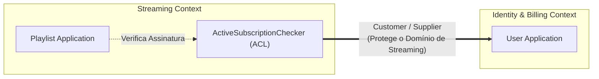
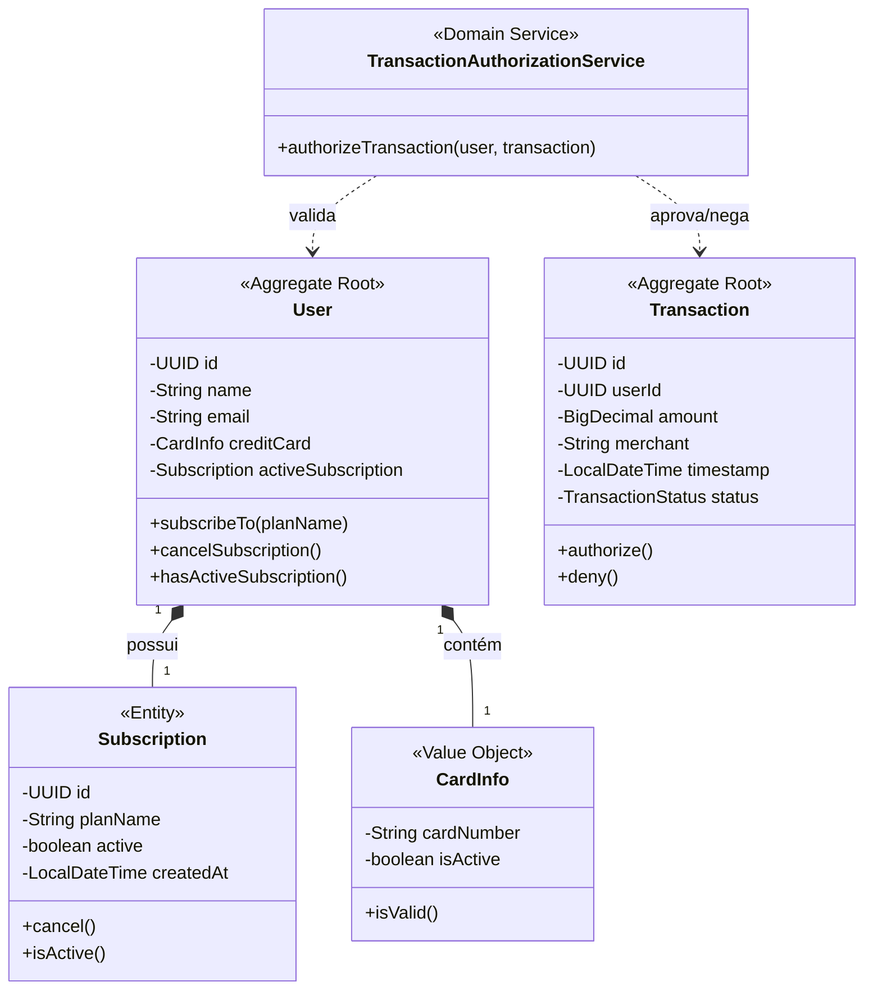
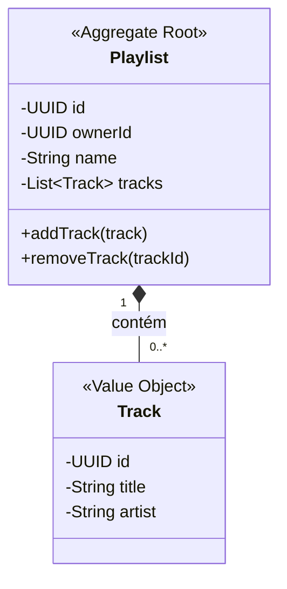

# 🎵 Music Streaming API - Billing & Streaming Contexts

Uma API REST completa para uma plataforma de streaming de música, construída do zero com Spring Boot.

Este projeto não é apenas um **CRUD de músicas**. Ele foi desenhado para resolver um problema complexo de negócio: como gerenciar assinaturas e aplicar regras rígidas de antifraude em transações financeiras, sem transformar o código em um espaguete acoplado.

Para isso, aplicamos **Domain-Driven Design (DDD)**, **Clean Architecture** e princípios **S.O.L.I.D**. para proteger o núcleo da aplicação.

---

## 🎯 O Desafio (Assessment)

O objetivo principal era desenvolver uma API para um aplicativo estilo Spotify, atendendo aos seguintes requisitos de negócios e regras antifraude:

1. O usuário pode ter somente um plano ativo.
2. O usuário deve ter um cartão de crédito válido.
3. Nenhuma transação deve ser aceita se o cartão não estiver ativo.
4. Não deve haver mais de 3 transações em um intervalo de 2 minutos (alta-frequência).
5. Não deve haver mais de 2 transações semelhantes (mesmo valor e comerciante) em 2 minutos (duplicação).

---

## 🏗️ Arquitetura e Padrões Aplicados

Para garantir o baixo acoplamento e a alta coesão, a estrutura foi dividida em dois Bounded Contexts principais: **Identity & Billing Context** e **Streaming Context**.

### 1. **Domínios Ricos (Rich Domain Model)**
Para evitar o **Anemic Domain Model**, nossas classes de domínio protegem seu próprio estado.
- **Exemplos:** `User.subscribeTo()` e `Playlist.addTrack()`.

### 2. **Domain Services**
As regras antifraude envolvem o histórico do usuário. Como um Aggregate não deve acessar o repositório, essa lógica foi extraída para o `TransactionAuthorizationService`.

### 3. **Context Mapping (Anticorruption Layer)**
O domínio de Streaming precisa saber o status da assinatura do usuário, mas sem importar classes do **Billing**. Foi criada a interface `ActiveSubscriptionChecker` para proteger essa fronteira.

### 4. **Intention Revealing Interfaces**
Os nomes dos métodos expressam a intenção real, utilizando a **Ubiquitous Language** (Linguagem Ubíqua) do domínio financeiro (ex: `Transaction.authorize()`).

### 5. **Inversão de Dependência (DIP) e Padrão Repository**
O coração da aplicação (**Domínio**) define as interfaces (`TransactionRepository`) e a camada de **Infraestrutura** é quem as implementa usando **Adapters**, isolando o **banco H2** do núcleo da **regra de negócio**.

---

## 🗺️ Domain-Driven Design: Diagramas e Decisões Arquiteturais

### 1. **Modelagem Estratégica (Context Mapping)**



  **Decisão Arquitetural:** Para evitar que os modelos do subdomínio financeiro se misturem com o core de reprodução, foi escolhido usar a **Anticorruption Layer (ACL)**. Isso ajuda a manter tudo organizado. Além disso, foi usado o padrão **Customer-Supplier**, que cria um contrato bem definido entre as partes. Aqui, `Billing` é a principal responsável pelas informações de assinaturas, e `Streaming` usa essas informações através de uma interface abstrata. Isso garante que os domínios fiquem isolados e não se influenciem mutuamente. A **Anticorruption Layer (ACL)** é fundamental para manter a ordem e a clareza no sistema.

### 2. **Modelagem Tática: Identity & Billing**



   **Decisão Arquitetural:** O **Aggregate Root** `User` atua como fronteira de consistência transacional para assinaturas e cartões (**Value Object** imutável). A **lógica de antifraude** foi delegada ao **Domain Service**, pois a avaliação de alta frequência depende do estado de múltiplas transações no tempo, responsabilidade que ultrapassa os limites de uma única entidade. O status mutável opera via intenções explícitas. Para garantir auditoria e rastreamento financeiro (compliance), transações não sofrem deleção do banco de dados (sem Hard Delete).

### 3. Modelagem Tática: Streaming



   **Decisão Arquitetural:** `Playlist` é o **Aggregate Root** que controla o ciclo de vida das `Tracks`. Neste caso, as músicas atuam como **Value Objects**, pois sua identidade global é secundária em relação à composição da lista. Qualquer alteração nas músicas ocorre apenas por meio da entidade principal para garantir que as regras de negócio sejam seguidas, como não permitir que uma faixa seja duplicada.

---

## 🚀 Como Executar o Projeto

Para garantir que o projeto rode em qualquer ambiente de forma limpa e sem necessidade de instalar configurações específicas de Java ou Maven na sua máquina local, a aplicação foi empacotada utilizando **Docker** com *multi-stage build*.

1. **Clone o repositório e acesse a pasta:**

   ```bash
   git clone https://github.com/leonardo-muniz/music-streaming-api-ddd-at.git
   cd music-streaming-api-ddd-at
   ```

2. **Construa a imagem Docker:**

   No terminal, execute o comando abaixo para baixar as dependências e compilar a aplicação:

   ```bash
   docker build -t streaming-api .
   ```

3. **Inicie o container:**

   Mapeie a porta 8080 para disponibilizar a API:

   ```bash
   docker run -p 8080:8080 --name streaming-api-container streaming-api
   ```

A API estará rodando isolada no container e pronta para receber requisições em `http://localhost:8080`. Se quiser parar a execução posteriormente, basta rodar `docker stop streaming-api-container`.

---

## 🔌 Endpoints da API

Abaixo estão os principais endpoints expostos pela aplicação para você testar as regras de negócio via Postman, Insomnia ou cURL.

### 💳 Identity & Billing Context

#### Assinar Plano

* **Ação:** Cria uma nova assinatura ativa para o usuário.
* **Rota:** `POST /api/v1/users/{userId}/subscribe`
* **Body (JSON):**

    ```json
    {
      "planName": "Premium Familiar"
    }
    ```
  
* **Resposta de Sucesso:** `200 OK`

#### Cancelar Assinatura

* **Ação:** Cancela a assinatura ativa atual do usuário.
* **Rota:** `POST /api/v1/users/{userId}/cancel-subscription`
* **Resposta de Sucesso:** `200 OK`

#### Processar Transação Antifraude

* **Ação:** Valida o cartão do usuário, checa o histórico de alta frequência e duplicidade, e aprova/nega a transação.
* **Rota:** `POST /api/v1/transactions/process`
* **Body (JSON):**

    ```json
    {
      "userId": "123e4567-e89b-12d3-a456-426614174000",
      "amount": 29.90,
      "merchant": "Spotify Premium"
    }
    ```

* **Resposta de Sucesso:** `201 Created`

#### Consultar Transação

* **Ação:** Retorna os detalhes de uma transação financeira específica, incluindo seu status de aprovação.
* **Rota:** `GET /api/v1/transactions/{transactionId}`
* **Resposta de Sucesso (`200 OK`):**

    ```json
    {
      "id": "f5a1b2c3-1234-5678-90ab-cdef12345678",
      "userId": "123e4567-e89b-12d3-a456-426614174000",
      "amount": 29.90,
      "merchant": "Spotify Premium",
      "status": "AUTHORIZED",
      "timestamp": "2026-06-23T10:15:30"
    }
    ```

### 🎧 Streaming Context

#### Adicionar Música na Playlist

* **Ação:** Verifica via ACL se o usuário possui uma assinatura ativa e, se sim, adiciona a música garantindo que não haja duplicação na lista.
* **Rota:** `POST /api/v1/playlists/{playlistId}/tracks`
* **Headers:** `X-User-Id: 123e4567-e89b-12d3-a456-426614174000` (Simula o ID do usuário autenticado no sistema)
* **Body (JSON):**

  ```json
   {
     "trackId": "987e6543-e21b-34d3-a456-426614174999",
     "title": "Bohemian Rhapsody",
     "artist": "Queen"
   }
  ```

#### Consultar Playlist

* **Ação:** Retorna os detalhes de uma playlist específica e a lista de músicas contidas nela.
* **Rota:** `GET /api/v1/playlists/{playlistId}`
* **Resposta de Sucesso (`200 OK`):**

  ```json
  {
    "id": "e4b3c2a1-1234-5678-90ab-cdef12345678",
    "name": "Rock Classics",
    "tracks": [
      {
        "id": "987e6543-e21b-34d3-a456-426614174999",
        "title": "Bohemian Rhapsody",
        "artist": "Queen"
      }
    ]
  }
  ```

#### Remover Música da Playlist

* **Ação:** Remove uma faixa específica de uma playlist.
* **Rota:** `DELETE /api/v1/playlists/{playlistId}/tracks/{trackId}`
* **Resposta de Sucesso:** `204 No Content` (Sem corpo de resposta)

---

## 🗄️ Acessando o Banco de Dados H2

As tabelas são geradas automaticamente baseadas nas entidades de persistência.

* **URL:** `http://localhost:8080/h2-console`
* **JDBC URL:** `jdbc:h2:mem:streamdb`
* **Username:** `sa`
* **Password:** `password`

---

## 🛠️ Tecnologias Utilizadas

* **Java JDK 26**
* **Spring Boot 4.1.0** (Web, Data JPA)
* **H2 Database** (Banco em memória)
* **Maven** (Gerenciamento de dependências)
* **Docker** (Containerização com Multi-stage build)
* Arquitetura baseada em **Domain-Driven Design (DDD)** e **Clean Architecture**.

Projeto desenvolvido por **Leonardo Muniz** para o Assessment da disciplina de **Design Patterns e Domain-Driven Design (DDD) com Java**.
